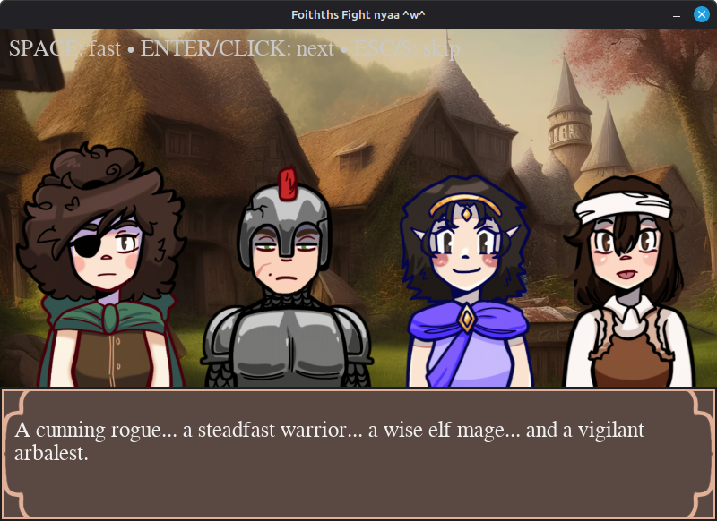
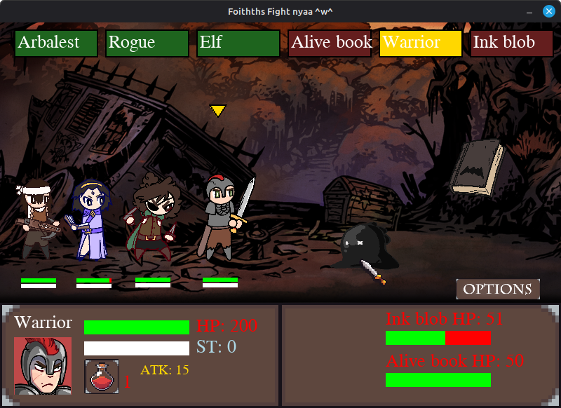
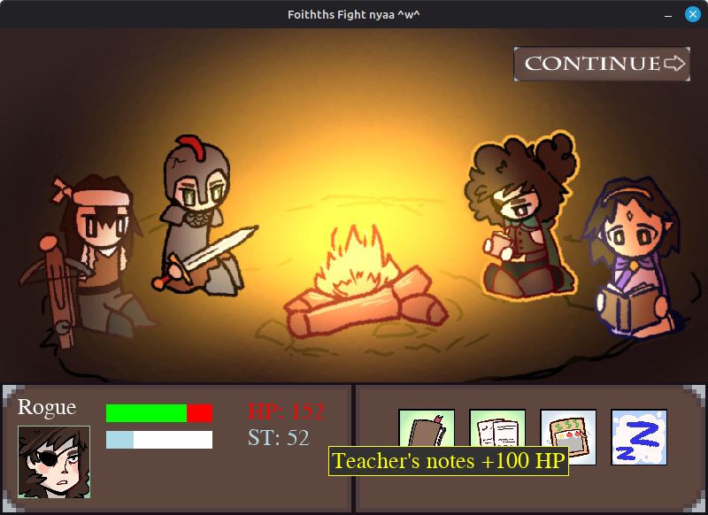

# 🎮 UniversibomboclatFight 

**UniversiFight** is a 2D turn-based RPG battle game built with **Python** and **Pygame**.
Players control a party of heroes fighting through different stages, battling monsters, defeating bosses and managing resources like health, potions, and stress.

The game combines **story scenes, exploration, and combat mechanics** into a modular scene-based system.

---

# ✨ How to Play!!!

[Download the **exe file** from "Releases"](https://github.com/Gemmiee/Universifight/releases/tag/Universifight_exe_file), unzip it and run the "Universifight.exe" inside the unzipped folder.

---

# 🖼️ Game Theme

The lore of Universifight is based off the daily academic life of a university student, specifically the exams season, but turned into a fantasy story. Thus, the 'obstacles' of the game include academic themed rivals but more medieval and fantasy themed, like magic books and classes turned into anthropomorphic horrors due to academic stress. Each boss is supposed to represent a university exam, where the four heroes fight through in order to 'defeat' the class (and pass it). The message that the game wants to promote is for students to fight through their exams, even as they appear stressful, and learn in the end that they shall come out victorious just like the four heroes in the game.

---

# 📸 Game Screenshots




---

# 🧭 Game Overview

In UniversiFight, players guide a party of heroes through multiple stages of encounters:

* 🧟 Mini-monster battles
* 🎒 Treasure chest events
* 🚶 Walking/exploration scenes
* 🏕 Resting at camp
* 👑 Boss fights representing different academic disciplines
* 🎉 A final victory ending scene

Each stage is structured as a **scene**, which is executed sequentially by the main game loop.

---

# ⚔️ Gameplay Mechanics

### Party System

The player controls a party of four characters:

* **Warrior**
* **Rogue**
* **Elf**
* **Arbalest**

Each character has:

* Health (HP)
* Strength
* Potions
* Stress level
* Unique animations

Stress affects combat performance — high stress reduces attack strength.

---

### Combat

Combat is **turn-based** and includes:

* Attacking enemies
* Taking damage
* Using potions
* Character death and animations
* Randomized attack damage

If stress reaches **100**, attack power is reduced.

---

### Boss Battles

The game features themed boss encounters:

* ⚙️ Brassan, the Engineering God
* ➗ Calxen, the Geometer
* 🧬 Helixor, the Blasphemer Biologist

Each boss represents the final challenge of a stage.

---

# 🧩 Project Structure

```
Universifight/
│
├── universifight.py      # Main game entry point
│
├── start_screen.py       # Main menu system
├── intro.py              # Game introduction cutscene
│
├── walking_scene.py      # Exploration scenes
├── chest_scene.py        # Treasure chest encounters
├── resting.py            # Camp/rest system
│
├── mini_monsters1.py     # Early enemy encounters
├── mini_monsters2.py
├── mini_monsters3.py
│
├── boss_battles.py       # Boss fight logic
│
├── options.py            # Settings & brightness
├── button.py             # UI button system
│
├── assets/               # Music, backgrounds, sprites
├── img/                  # Character animations & icons
│
└── README.md
```

---

# 🧠 Scene System

The game runs using a **scene pipeline**.

Example from the main file:

```python
scenes = [
    first,
    chest,
    mini_monsters1,
    engineering_boss,
    camp_wrapper,
    switch_theme(STAGE2_THEME),
    mini_monsters2,
    mathematics_boss,
    camp_wrapper,
    switch_theme(STAGE3_THEME),
    mini_monsters3,
    biology_boss,
    victory_scene
]
```

Each scene returns control to the main loop when finished.

This modular design allows new events or encounters to be easily added.

---

# 🎨 Features

* 🎭 Animated characters and enemies (handmade, guess by who :D)
* ⚔️ Turn-based combat system
* 🎵 Dynamic background music with theme switching
* 🧠 Stress mechanic affecting combat performance
* 🏕 Camp rest system between stages
* 📜 Story intro and victory ending scenes
* 🌗 Adjustable brightness settings
* 🔁 Restartable campaign

---

# 🛠️ Requirements

Python **3.9+** recommended.

Libraries used:

```
pygame
pygame-widgets
```

Install dependencies:

```bash
pip install pygame pygame-widgets
```

---

# ▶️ Running the Game

Clone the repository:

```bash
git clone https://github.com/Gemmiee/Universifight.git
```

Navigate into the folder:

```bash
cd Universifight
```

Run the game:

```bash
python Universifight.py
```

---

# 🎵 Music System

The game dynamically switches music themes depending on the stage.

Examples:

* Main theme
* Camp theme
* Stage themes
* Ending theme

Music transitions use **crossfading** for smooth switching.

---

# 📜 License

No license.

## References

* Game mechanics and backgrounds are heavily based on "Darkest Dungeon".
* Music taken from "Skyrim" as well as some other creators.
* The game was created from a starter ["Final Fantasy" PyGame code found in YouTube](https://www.youtube.com/watch?v=Vlolidaoiak&list=PLjcN1EyupaQnvpv61iriF8Ax9dKra-MhZ). All the assets in the game including **character sprites, enemies, face icons, camp, final ending screen, icons** (except from the potion, sword icon and the chest assets), where made by Gemmie with IbisPaintX.

---

# 👤 Authors

- Tsea Anastasia (@Gemmiee)
- Papakyriazh Leda (@ledapap)
- Vagianos Vasilis (@vasiliss0billyy0)

